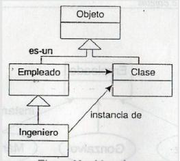
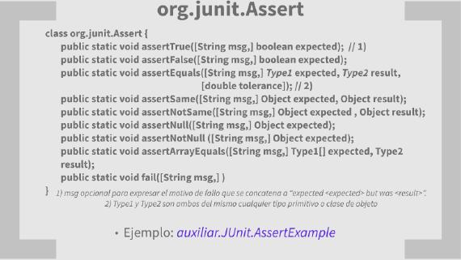
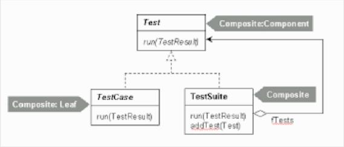
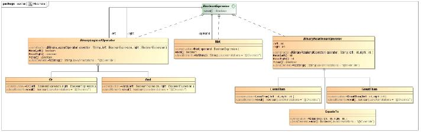
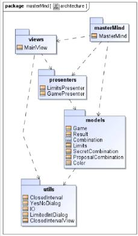

= Sobre JUnit
Santa Tecla <parqueNaturalSantaTecla@gmail.com>
:toc-title: Índice
:toc: left

:idprefix:
:idseparator: -
:imagesdir: images

== Prerrequisitos

- *Sobre las Pruebas del Software*

* Justificación y Objetivos

* Coberturas de Pruebas: Exceso,Defecto y Equilibrio(Eficacia y Eficiencia)

* Definicion: Validación vs Verificación;Caracteristica,SUT,DOC,y Caso de Prueba;Ejecucion de Pruebas: [lime]#*Verde*#(éxito/falso positivo); [red]#*Rojo*#(falllo/error/falso negativo)

* Tipos de Pruebas: según el SUT (unitarias/componentes/integracion/sistema/aceptación);según la Caracteristica (funcionales/no funcionales: rendimientos, carga, estrés,...mantenibilidad);según la Ejecución (manual/automatca); según la Táctica (estática/dinámicas: caja negra y caja blanca)

* Herramientas: Pruebas estáticas(CASE,Analiticas);Pruebas Dinámicas(de Registro:API -JMockit-,UI-Selenium-,de Guión: API-JUnit-,UI-JUnit moderno).No funcionales-JMeter-.Integración Continua(Definición,Entornos,Requisitos,Ejecución de pruebas y Beneficios)

* Metodologías: TLD,TFD,TDD,BDD

== Justificación

- *No es necesario ningún framework para la gestión de pruebas automáticas*:

* Instanciar objetos que contengan el SUT

* Enviar mensajes para ejecutar el SUT

* Elevar una exepción si se verifica que la respuesta del SUT no es la esperada.

** Ejemplo sin _Junit_:

*** Producción: _[red]#ticTacToe.utils.Coordinate#_

*** Test: _[red]#auxiliar.withoutJUnit.CoordinateTest#_

** Ejemplo sin _JUnit_

*** Producción: _[red]#ticTacToe.utils.ColosedInterval#_

*** Test: _[red]#auxiliar.withoutJUnit.ClosedInterval#_

* *Pero es muy conveniente para falicitar y acelerar su gestión*

== Objetivos

- Permite [lime]#gestionar eficientemente el código de pruebas unitarias,de componentes,integración y sistemas#(MVP-CP)

- Habilitar  mecanismos para la [lime]#reusabilidad del código de pruebas#

- Habilita [lime]#funciones estáticas especializadas para mejorar la legibilidad del código frente a la sentencia _assert_# original del lenguaje

- Permite definir una [lime]#Jerarquia de Conjuntos de Clases de Pruebas# (_Suite_) que  [lime]#automatiza la ejecución de la totalidad de las Pruebas de Regresión#

- Permite definir [lime]#Categorias de Clases de Pruebas# (@Categories) que [lime]#automatiza ejecución de subconjuntos de la totalidad de los Casos de Prueba como para las pruebas Alfa,Beta o Humo#

== Definición

- Sencillo *_framework_* (varias librerias de clases relacionadas y extensibles)

- Creado por *Kent Beck* y *Erich Gamma* Para escribir pruebas repetibles.

- Es una instancia de *XUnit*,arquitectura para _framework_ de pruebas unitarias (*_CppUnit,PhpUnit,XUnit,Net,_*...)

- Incluye

* varios *visualizadores de resultados(runners)* que puede ser en modo *_texto,gráfico(AWT,Swing,_*..) o como *tarea de un gestor de proyectos (_Ant,Maven,_..)*

* *_Puug-ins_ para principales IDEs(_Eclipse,NetBeans,_..*

- Basado en :

* *Metaclases*

* *Anotaciones*

* *Aserciones*

* *Patrones de Diseño*: Composite (Suite)/ Command (TestCase)

=== Metaclases

- Es una *clase cuyas instancias son clases* que permiten la *reflexión* del código: un código que manipula como información paquetes,clases,método,atributos,objetos y mensajes

* Ejemplo: [blue]#_auxiliar.withoutJUnit.MetaClazzesExample_#

* Ejemplo: [blue]#_auxiliar.withoutJUnit.MetaClazzesInspectorExample_#

=== Anotaciones

- Anotación es un mecanismo para añadir metadatos al código fuente Java que están disponibles en tiempo de compilación/ejecución.

* Ejemplos:

** [lime]#@Override,@SupressWarning#_...para el *IDE*

** [lime]#@Entity,@Key#_,...para *JPA* de *Swing*

*** Ejemplos: [blue]#_auxiliar.withoutJUnit.AnnotationExample_#

*** Ejemplo: [blue]#_auxiliar.withoutJUnit.ClazzExample_#

*** Ejemplo: [blue]#_auxiliar.withoutJUnit.MetaClazzesWihtAnnotationsExample_#

=== Aserciones

- Todas las funciones tienen un semántica similar al *assert*:

* se comprueba una condición,[lime]#si es cierta continúa la ejecución.#

* En caso contrario,[red]#la prueba no pasa y se continúa la ejecución por otro método de prueba de la clase#

== Unitarias

- Las [lime]#Clases de Pruebas# son clases normales (*POJO*) del lenguaje con atributos,métodos públicos y privados,miembros estáticos...relacionadas con otra clases como las del SUT que se ejercite, auxiliares(Factory,Builder,...)sin ninguna limitación 

- Su nombre debe terminar con el [lime]#sufijo "Test"#

* Ejemplo:

** _[blue]#ticTacToe.models.InheritBoardTest#_

** _[blue]#ticTacToe.models.InheritSetBoardTest#_

** _[blue]#ticTacToe.models.InheritDecisionTreeBoardTest#_

=== Organización 

- [blue]#Código de Prodicción# *separado* del [lime]#Código de Pruebas#

[cols="50,50",frame=none,grid=none]
|===

a|*src/main/java*   a|*src/test/java*  

a|para el [blue]#Código de Producción# con un Jerarquia de Paquetes de Paquetes de la Arquitectura del Software

* *xxx.yyy.zzz.A*
* *xxx.yyy.zzz.B*
* ...

a|para el [lime]#Código de Pruebas Unitarias# con una Jerarquia de Paquetes paralela a la Arquitectura del Software del [blue]#Código de Producción#

* *xxx.yyy.zzz.ATest*
* *xxx.yyy.zzz.BTest*
* ...

a|*src/main/resources* 
a|*src/test/resources*

a|para los [blue]#Recursos de Producción#: imágenes de UI,ficheros de configuración,...con la estructura que se considere más adecuada

a|para los [blue]#Recursos de Pruebas#:ficheros de datos para alimentar las pruebas,...con una Jerarquia de Paquetes paralela a la jerarquia *src/test/java/ para facilitar biunivocamente la localización de recursos de una prueba dada

|===

== Pruebas Funcionales

=== Método de Pruebas

==== Cabecera

[cols="50,50",frame=none,grid=none]
|===

a|
[source,java]
@Test public void test <nombre>(){...}_

* decorado con la anotación [lime]#@Test#
* siempre *público sin parametros y no devuelve nada*
* el *nombre debe determinar de forma inequívoca lo que se está probando* del SUT,alcanzando la longtitud que sea necesaria comenzando por el *prefijo "test"*(p.e "testLenght").
* En caso de sobrecarga,añadir al nombre los nombres de los parámetros que los distinguen(p.e."testIncludesInt" y "testIncludesClosedInterval")  

a|Cuando se ejecuta una [lime]#Clase de Pruebas#,por cada [lime]#Método de Prueba (@Test)#,en un *orden"desconocido"*,:

* se crea un objeto de la [lime]#Clase de Pruebas#,a través de *reflexion*,metaclases
* se le pasa el *mensaje correspondiente al* [lime]#Metodo de Prueba# 
* Cuando ocurre un [red]#fallo en una aserción# en el código de pruebas,[red]#se aborta su ejecucion#
* Cuando ocurre un [red]#error en una sentencia del código de pruebas o del código de producción#,si no se captura especificamente con la sentencia try/catch/finally,[red]#se aborta la ejecución#
* [red]#En cualquera de los dos casos anteriores# y [lime]#cuando la prueba pasa#,se *continúa la ejecución con otro* [lime]#Método de Pruebas# *sobre otro objeto de la* [lime]#Clase de Pruebas#
|===

- Ejemplo: _[blue]#auxiliar.junit.ExecutionTest#_

==== Cuerpo

- Una triple A y una parte opcional final:

* *Preparacion*(*Arrange/Seup*): para creación,relación,gestión de recursos(ficheros de datos,bases de datos,...),...de los objetos del SUT

* *Acción*(*Act*): para la ejercitación del SUT por el camino establecido en la prueba 

* *Aserción*(*Assert*): para la comprobación de que el resultado esperado coincida con el resultado obtenido

* *Demolición*(*TearDown*): en caso necesarío,para liberar los recursos que fueron necesarios y devolverlos al estado anterior faciitando la idependencia de otros Métodos de Pruebas poder reutilizarlos en otro Metodos de Pruebas evitando su continua re-creación(no recomendado!!!)

** Ejemplo:

*** _[blue]#ticTacToe.models.TurnTest#_
*** _[blue]#ticTacToe.models.TurnCompactTest#_
*** _[blue]#ticTactoe.models.TurnWithAttributesTest#_
*** _[blue]#ticTacToe.models.TurnWithConstructorTest#_

==== Reusabilidad

- Para ejecutar automáticamente,a través de anotaciones,el código común de los [lime]#Métodos de Prueba#:

* para la preparación(*Arrange*) del mismo conjunto de accesorios/recursos: *@Before*

* para la demolición(*TearDown*) del mismo conjunto de accesorios/recursos: *@After*

* *Ambos son de instancia sin parámetros y no devuelven nada*

- Para ejecutar automáticamente el código previo y posterior a la ejecución de todos los [lime]#Metodos de Pruebas#:

* para la preparación(*Arrange*) del mismo conjunto de accesorios/recursos: *@Beforeclass*

* para la demolición (*TearDown*) del mismo conjunto de accesorios/recursos: *@AfterClass*

* *Ambos son estáticos sin parámetros y no devuelven nada*

** Ejemplos:

*** _[blue]#auxiliar.junit.ExecutionReusabilityTest#_

*** _[blue]#ticTacToe.models.TurnWithBeforeTest#_

*** _[blue]#ticTacToe.models.TurnSharedTest#_

==== Exepciones

[cols="25,25,25,25",frame=none,grid=none]

|===

a|Con *excepciones*:
tras el ejercicio del
SUT que eleva la excepción,
capturar la exepción esperada
sin ninguna acción pero fallando
([red]#fail#)en ausencia de
la exepcion o si fuera de otro tipo

a|
[source,java]
@Test
public void testX() {
    try{
   //arrange
   //act with XExcepcion
   *fail*();
 }catch(*XExcepcion* e) {
 }catch (Excepcion e) {
  *fail*(); 
  }
 }

* si el SUT devuelve 
*AssertionError* se
cambiará por *throw new*
*Exception*();
   
a|Con la *anotación*
[teal]#@Test# especificando
la clase de excepción 
esperada en su
*atributo* [teal]#expected#

a|
[source,java]
@Test(expected=XException)
 public void testX() {
  //arrange
  //act wihtXEception
}

|===

- Ejemplos:

* _[blue]#auxiliar.junit.ExecutionReusabilityTest#_

* _[blue]#ticTacToe.models.CoordinateWithExceptionTest#_

* _[blue]#ticTacToe.models.CoordinateWithExpectedTest#_

* _[blue]#ticTacToe.models.SetBoardWithExceptionTest#_

* _[blue]#ticTacToe.models.SetBoardWithExpectedTest#_

=== Clase de Pruebas Parametrizada

- En muchas clases de pruebas [red]#se escribe y se reescribe la creación de muchos objetos# del SUT para ser ejercitados en distintos métodos de pruebas

- Las [lime]#Clases de Pruebas Parametrizadas# buscan [lime]#reutilizar los mismos accesorios del SUT escritos# en todos los métodos de pruebas de la clase para cada elemento de una colección de accesorios del SUT definida [lime]#separada y extensiblemente#.

* Ejemplos:

** _[blue]#ticTacToe.utils.ClosedIntervalTest#_

** _[blue]#ticTacToe.utils.CoordinateTest#_

** _[blue]#ticTacToe.utils.ClosedIntervalWithoutParametrizedTest+#_

** _[blue]#ticTacToe.utils.ClosedIntervalObjectTest#_

** _[blue]#ticTacToe.utils.CoordinateWithoutParametrizedTest+#_

** [blue]#_ticTacToe.utils.CoordinateObjectTest_#

=== Conjunto de Pruebas

- *Jerarquía de Pruebas*

- *Categorías de Pruebas*

* Mediante la anotación [lime]#@ignored# acompañando al [lime]#Metodo de Prueba#,el _framework_ *no ejecutará* dicho caso de prueba

==== Jerarquía de Pruebas

- Un [lime]#Conjunto de Pruebas# es una clase que permite la *ejecucion de un conjunto* de [lime]#Clases de Pruebas# (*Composite Pattern*)

- *Requisitos*:decora la clase vacia con:

[source,java]
....
@RunWith(Suite.Class)
@Suite.SuiteClasses({
  <Clase1Test>.class,
  <Clase2Test>.class,
  <ConjuntoPruebas3Test>.class,
  <ConjuntoPruebas4Test>.class
})
class <ConjuntoDePruebas>Test{}
....

- *Regla de Estilo*:incorpora una [lime]#Conjunto de Pruebas# denominado [lime]#AllTest# en *cada paquete* de clases de prueba,incluyendo a todas las [lime]#Clases de Pruebas Unitarias# *del paquete* y los [lime]#Conjuntos de Pruebas AllTest# *de todos subdirectorios*,de tal manera que [lime]#src/test/java/<proyecto>/AllTes# dispare la ejecucion de todas las pruebas acumuladas ([lime]#Pruebas de Regreción#)

* Ejemplos: [blue]#AllTest en cada subdirectorio de raiz src/test/java/#

==== Categorías de Pruebas

- Para poder [lime]#configurar sub-conjuntos de pruebas# (p.e.[lime]#Pruebas alfa,beta,humo#,...)

* Requisitos

** definir una *interfaz vacía por cada categoria*(p.e.AlfaTest
.class,...)

** decorar los [lime]#*Metodos de Prueba*# apropiados de cada categoría con la anotación [lime]#*@Category*({<Categoría1>,*class*[, <Categoria2>,*class*,...*]}) cuyo argumento es la *lista de clases de categoría a las que pertenece el método*

** decorar el [lime]#*Conjunto de Pruebas*# a configurar con anotaciónes [lime]#*@IncludeCategory* ({<Categoría1>,*class*[,<Categoria2>,*class*,...]})# y [lime]#*@ExcludeCategory* ({<Categoría1>,*class*[,,<Categoría2>,*class*,...]})# cuyo argumento,en ambos casos,es la lista de clases de categoría incluidas y excluidas respectivamente

- *Ejecución*: el _framework_ *ejecutará todos los métodos de prueba de las categorías especificadas como incluidas que no sean de las categorías excluidas*

* Ejemplos: _[blue]#Todos los interfaces y Clases en la jerarquia de raiz auxiliar.junit.categories#_

== Pruebas No Funcionales

- *Pruebas de Rendimiento*

* *Requisitos no funcional*.Ej: el cálculo de la existencia de las Tres en Raya no puede exceder los 5msg

* [lime]#JUnit# incorpora el atributo [lime]#timeout# en la anotación [lime]#@Test# con el valor del *tiempo máximo en milisegundos que se concede al método para su ejecución*.Una vez *expirado el tiempo ,la prueba falla*.En caso contrario,dependerá del código de la prueba

** Ejemplos:

*** _[blue]#ticTacToe.models.EfficiencySetBoardTest3#_
*** _[blue]#ticTacToe.models.EfficiencyDecisionTreeBoardTest#_

== Aserciones Avanzadas

- [red]#1^a^Generación#: *_assert <exprecion>_*; _del lenguaje [red]#Java#_

- [blue]#2^a^Generación#: *_assertEquals(<expected>,<actual>);assertNotNull(<actual>)_*;.... de [blue]#Junit#

- [lime]#3^a^Generación#: *_assertThat(value,Matcher matcher);_* extención de [lime]#org.hamcrest#

* donde *Matcher* puede ser *is(),not(),anyOf(),allOf(),contains(),greatherThan(),...* emparejadores encadenados

* *Matchers*
* *Objetivos*

** Ejemplo:

*** _[blue]#auxiliar.junit.AssertThatTest#_

=== Matchers

- *Patrón Intérprete*:dado un lenguaje,define una representación para su gramática junto con un intérprete del lenguaje

* [lime]#Matchers#: lenguaje e intérprete de "emparejadores" con programación genérica

_static<T>Matcher<java.land.Iterable<?extends T>>_

_constainsInAnyOrder(Matcher<?super T>...itemMatchers)_

** Ejemplo:

*** _[blue]#auxilliar.junit.Matchers#_

*** _[blue]#auxilliar.junit.StaticMatchers#_

=== Objetivos

[cols="50,50",frame=none,grid=none]

|===

2+^a|- *[lime]#Aumentar la legibilidad#*
a|
[source,java]
....
assertEquals(expected,actual)  
....
a|
[source,java]
....
assertThat(actual,is(equalTo(expected)));
....
2+^a|- *[lime]#Mejorar los mensajes#*

a|

[source,java]
....
assertTrue*(expected.contains(actual));java.lang.AssertionError ot...
....
a|
[source,java]
....
assertThat(actual,containsString(expected));java.lang.AssertionError: Expected: a string containing "abc" got:"del"
....

2+^a|- *[lime]#Imponer seguridad de tipos#*
 
a|
[source,java]
....
assertEquals("abc",123;//compiles,but fails 
....
a|
[source,java]
....
assertThat(123,is("abc"));//does not compile
....

2+^a|- *[lime]#Aumentar la flexibilidad#*

a|
[source,java]
....
assertTrue("test".contains("x")&&"test".contains("y"));
....
a|
[source,java]
....
assertThat("test",allOf(contantsString("x"),
containsString("y")));
java.lang.AssertionError:
Expected: (is"test2" or a string containing "ca")
got:"test"
....
|===

== Componentes

- [orange red]#¿Todas las Clases de Pruebas mostradas anteriormente son unitarias?#*Existe un debate*:

* *No*!Estrictamente son aquellas que *[red]#NO#* *incorporan más de una clase en el SUT, sin ejercitar DOC´s* (p.e._Coordinate Test_ no porque incorpora el enumerado _Direction;BoardTest_ no porque incorpora objetos de la clase _Coordinate_;...)sin dobles,se ejercita más de una clase!!!

** *Entonces deberían estar como* [lime]#Pruebas de Componentes#...*casi todas!O se ponen dobles!*

* *Si*!Relajadamente porque*no salen del ámbito del componente*: no acceden a clases de otros paquetes,no son de componentes

** *Entonces deberían estar como* [lime]#Pruebas de Unidad#!*No existen* [lime]#Pruebas de Componentes#!

* *Si*!Relajadamente porque *no salen del código de pruducción*:no acceden a recursos externos(ficheros,base de datos,servicios,...a través de otros componentes software(librerías,protocolos,...),no son de integración

** *Entonces no existen* [lime]#Pruebas de Componentes#! *Se consideran todas unitarias!*

* *Solución "practica"*: muchos desarrolladores no contemplan la existencia de [lime]#Pruebas de Componentes#
especificamente y las consideran junto con las [lime]#Pruebas Unitarias# sin distinción

** Elemplo:

*** _[blue]#ticTacToe.models.GameTest#_

== Integración

- Serán aquellas que en el ejercicio del *SUT se colabora con un DOC desarrollado en otro componente* (p.e.un _jar_ de una libreia,un servicio de bases de datos,de...)

* Ejemplo:

** _[blue]#integration.DecisionTreeBroadTest#_

- Si no interesa que sea una [lime]#Prueba de Integración#(p.e. para no decelerar las [lime]#Pruebas de Regreción#),habría que incorporar un *doble para el DOC* y, asi convertirla en [lime]#Prueba Unitaria/de Componente#

== Sistema

- *Arquitectura Modelo/Vista/Presentador de Modelo*:

* *Modelo(Model)* con la responsabilidad de manejar los datos y la funcionalidad del negocio

* *Vista(View)* con la responsabilidad de manejar los controles de interfaz,la sincronización de la presentación pero eliminando el estado y la lógica de la presentación (*Humple View pattern*)

* *Presentador(Presenter)* con la responsabilidad total del estado y lógica de la presentación e solicitar funcionalidades de los modelos(*Plain Old Java OBject:POJO*)

** *[lime]#Pruebas de los Presentadores ejercitan el sistema un ~9X%#*

== Bibliografia

[cols="25,25,25,25",options="header",grid=177,frame=266]
|===

a|Libro Autor Editor 
a|Portada

a|Libro Autor Editor 
a|Portada

a|- LIBRO:Pragmatic Unit Testing in Java with JUnit
* AUTOR: Andy Hunt;Dave Thomas
* Editor: The Pragmatic Programmers (1674)
a|image::PragmaticUnitTestinginJavawithJUnit.jpg[width=177,height=266]

a|- LIBRO:xUnit Test Patterns: Refactoring Test Code
* AUTOR: Gerard Meszaros 
* Editor: Addison-Wesley Educational Publishers Inc; Edición: 01 (21 de mayo de 2007)
a|image::xUnitTestPatternsRefactoringTestCode.jpg[width=177,height=266]

a|- LIBRO:Effective Unit Testing
* AUTOR:Lasse Koskela
* Editor: Manning Publications Company; Edición: 1 (16 de febrero de 2013)
a|image::EffectiveUnitTesting.jpg[width=177,height=266]

a|* Libro:Testing Computer Software
* Autor: Cem Kaner,Jack Falk,Hung Q. Nguyen
* Editor: Wiley John + Sons; Edición: 2nd (12 de abril de 1999)
a|image::TestingComputerSoftware.jpg[width=177,height=266]

a|- LIBRO:The Art of Software Testing
 * AUTOR:Glenford J. Myers
 * EDITOR:John Wiley & Sons Inc; Edición: 3. Auflage (16 de diciembre de 2011)
a|image::TheArtofSoftwareTesting.jpg[width=177,height=266]

a|- LIBRO:Diseno Agil con TDD
* AUTOR:Ble Jurado, Carlos 
* Editor: Lulu.com (18 de enero de 2010)
a|image::DisenoAgilconTDD.jpg[width=177,height=266]

a|- LIBRO:Test Driven Development
* AUTOR:	Kent Beck
* Editor: Addison Wesley; Edición: 01 (8 de noviembre de 2002)
a|image::TestDrivenDevelopment.jpg[width=177,height=266]

a|- LIBRO:Growing Object-Oriented Software, Guided by Tests
* AUTOR:Steve Freeman
* Editor: Addison-Wesley Professional (12 de octubre de 2009)
a|image::GrowingObjectOrientedSoftware,GuidedbyTests.jpg[width=177,height=266]

a|- Libro:How Google Tests Software
* Autor:James A. Whittaker,Jason Arbon,Jeff Carollo
* Editor: Addison-Wesley Educational Publishers Inc; Edición: 01 (2 de abril de 2012)
a|image::HowGoogleTestsSoftware.jpg[width=177,height=266]

a|- Libro:Pragmatic Project Automation: How to Build, Deploy, and Monitor Java Apps
* Autor: Mike Clark 
* Editor: The Pragmatic Programmers (1900)
a|image::PragmaticProjectAutomation.jpg[width=177,height=266]

|===

